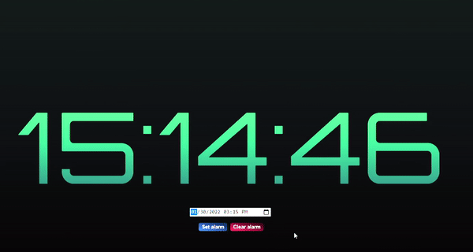

# 

This is an-online alarm clock project that I learned to develop.

In this website you can set any date/time where you will actually hear an alarm sound and get a pop up.

<a href="https://jesserds.github.io/web-alarm/" target="_blank">Check it out</a>:

